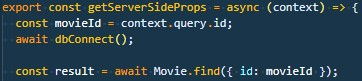

## Connect to MongoDB

Inside the /lib directory you will find dbConnect.js. Use this to establish a connection to the databse to enable queries with Schemas.



> Awaiting the connection and then doing a query to find a movie with a specific id

## Schema/Models

###### Movie

```
const MovieSchema = new mongoose.Schema({
  id: String,
  title: String,
  description: String,
  imgUrl: String,
  screenings: [
    {
      date: String,
      time: String,
    },
  ],
  reviews: [
    {
      date: String,
      comment: String,
      rating: String,
    },
  ],
});
```

## Movie page

Dynamic routes is used for selected Movie page. SSR for on request based fetching of data from database

_GET /movies/:id_

## API Routes

_GET /api/movies_

```
{
    "success": true,
    "data": [
        {
    "success": true,
    "data": [
        {
            "_id": "62606d511d2a9fbd7d4622f8",
            "id": "1",
            "title": "the Batman",
            "description": "When the Riddler, a sadistic serial killer, begins murdering key political figures in Gotham, Batman is forced to investigate the city's hidden corruption and question his family's involvement.",
            "imgUrl": "/static/covers/cover1.jpg",
            "screenings": [
                {
                    "date": "2022-05-01",
                    "time": "22:00"
                },
                {
                    "date": "2022-05-02",
                    "time": "19:00"
                }
            ],
            "reviews": [
                {
                    "date": "2022-05-21 14:32",
                    "comment": "Amazing movie",
                    "rating": "4"
                },
                {
                    "date": "2022-05-21 01:03",
                    "comment": "It was okay",
                    "rating": "3"
                }
            ]
        },
        {
            "_id": "62613ee332bca1b5643ced87",
            "id": "2",
            "title": "Thor: Love and Thunder",
            "description": "Thor enlists the help of Valkyrie, Korg and ex-girlfriend Jane Foster to fight Gorr the God Butcher, who intends to make the gods extinct.",
            "imgUrl": "/static/covers/cover2.jpg",
            "screenings": [
                {
                    "date": "2022-05-01",
                    "time": "22:00"
                },
                {
                    "date": "2022-05-02",
                    "time": "19:00"
                }
            ],
            "reviews": [
                {
                    "date": "2022-05-21 14:32",
                    "comment": "Amazing movie",
                    "rating": "4"
                },
                {
                    "date": "2022-05-21 01:03",
                    "comment": "It was okay",
                    "rating": "3"
                }
            ]
        },
    ]
}
```
